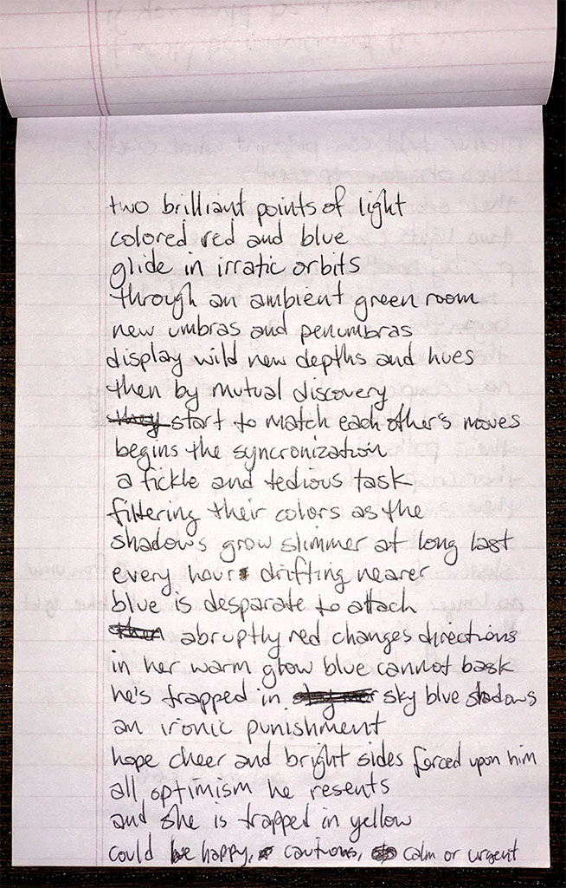
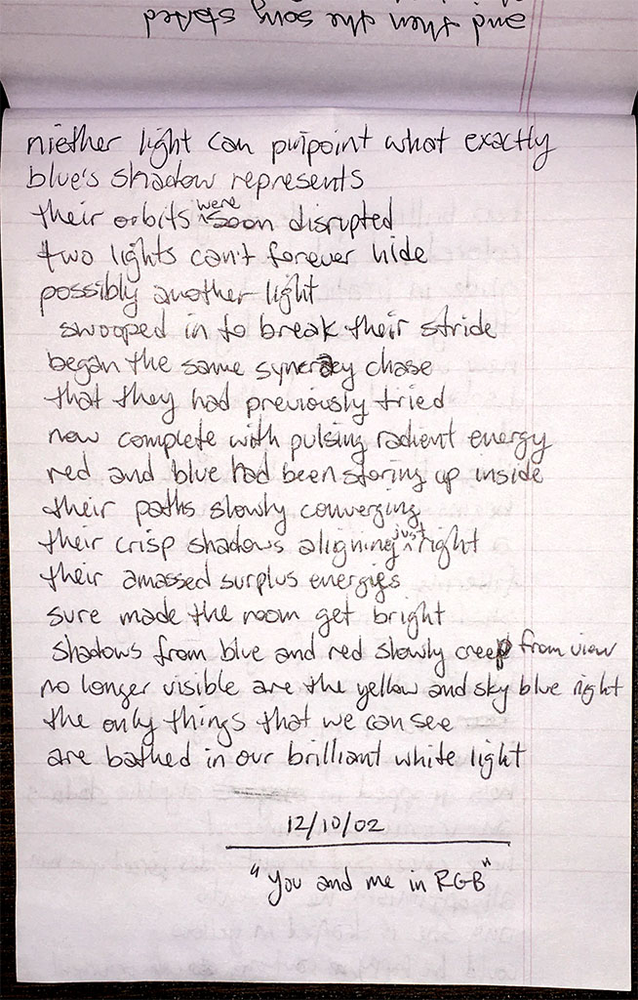

### you and me in RGB

two brilliant points of light \
colored red and blue \
glide in erratic orbits \
through an ambient green room

new umbras and penumbras \
display wild new depths and hues \
then by mutual discovery \
start to match each other's moves

begins the synchronization \
a fickle and tedious task \
filtering their colors as the \
shadows grow slimmer at long last

every hour drifting nearer \
blue is desperate to attach \
abruptly red changes directions \
in her warm glow blue cannot bask

he's trapped in sky blue shadows \
an ironic punishment \
hope cheer and bright sides forced upon him \
all optimism he resents

and she is trapped in yellow \
could be happy, cautious, calm, or urgent \
neither light can pinpoint what exactly \
blue's shadow represents

their orbits were soon disrupted \
two lights can't forever hide \
possibly another light \
swooped in to break their stride

began the same syncracy chase \
that they had previously tried \
now complete with pulsing radiant energy \
red and blue had been storing up inside

their paths slowly converging \
their crips shadows aligning just right \
their amassed surplus energies \
sure made the room get bright

shadows from blue and red slowly creep from view \
no longer visible are the yellow and sky blue night \
the only things that we can see \
are bathed in our brilliant white light

`2002.12.10`

