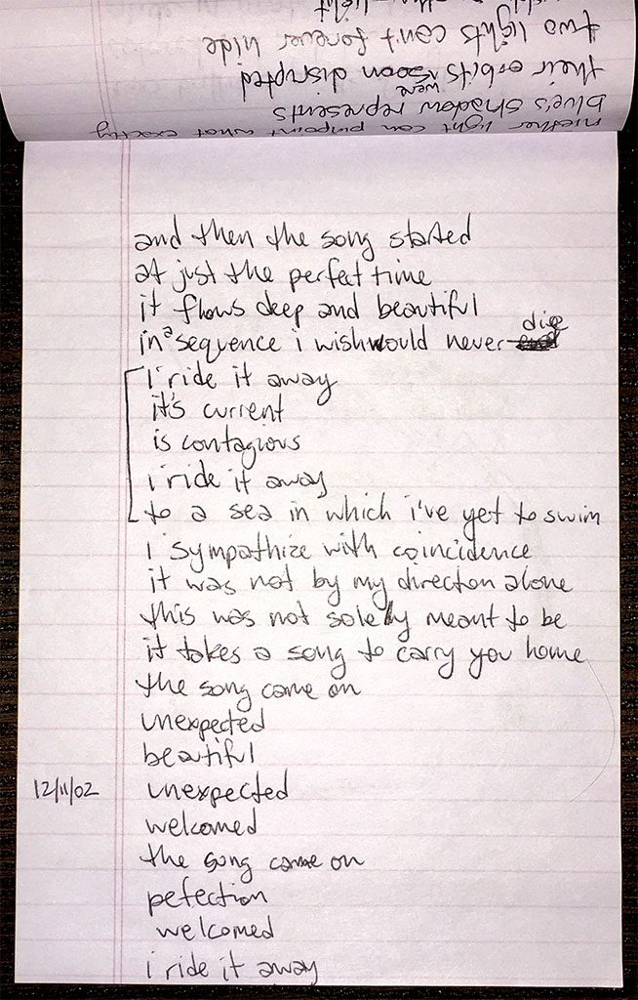

### song started

and then the song started \
at just the perfect time \
it flows deep and beautiful \
in a sequence i wish would never die

i ride it away \
its current \
is contagious \
i ride it away \
to a sea in which i've yet to swim

i sympathize with coincidence \
it was not by my direction alone \
this was not solely meant to be \
it takes a song to carry you home

the song came on \
unexpected \
beautiful \
unexpected \
welcomed \
the song came on \
perfection \
welcomed \
i ride it away

`2002.12.11`

