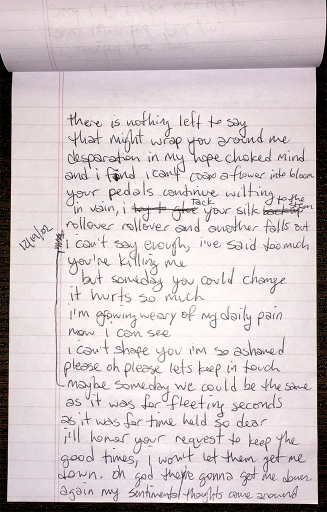

### someday

there is nothing left to say \
that might wrap you around me \
desperation in my hope choked mind \
and i find i can't coax a flower into bloom

your petals continue wilting \
in vain, i tack your silk to the stem \
rollover rollover and another falls out \
i can't say enough, i've said too much

you're killing me \
but someday you could change \
it hurts so much \
i'm growing weary of my daily pain

now i can see \
i can't shape you i'm so ashamed \
please oh please let's keep in touch \
maybe someday we could be the same

as it was for fleeting seconds \
as it was for time held so dear \
i'll honor your request to keep the \
good times, i won't let them get me down. \
oh god they're gonna get me down. \
again my sentimental thoughts come around

`2002.12.19`

