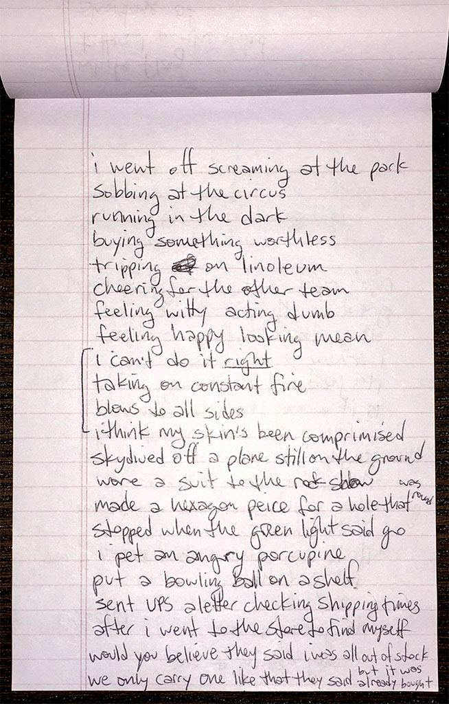
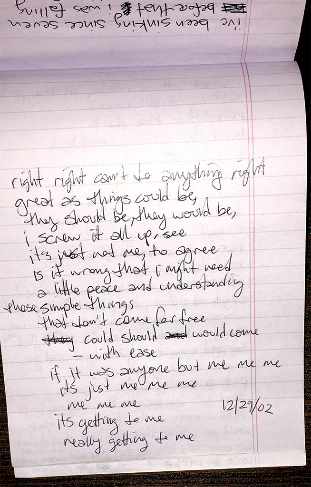

### constant fire

i went off screaming at the park \
sobbing at the circus \
running in the dark \
buying something worthless \
tripping on linoleum \
cheering for the other team \
filling witty acting dub \
feeling happy looking mean

i can't do it _right_ \
taking on constant fire \
blows to all sides \
i think my skin's been compromised

skydived off a plane still on the ground \
wore a suit to the rock show \
made a hexagon piece for a hole that was round \
stopped when the green light said go \
i pet an angry porcupine \
put a bowling ball on a shelf \
sent UPS a letter checking shipping times \
after i went to the store to find myself

would you believe they said i was all out of stock \
we only carry one like that they said \
but it was already bought

right right can't do anything right \
great as things could be \
they should be, they would be \
i screw it all up, see \
it's just not me, to agree \
is it wrong that i might need \
a little peace and understanding

those simple things \
that don't come for free \
could should would come \
 -- with ease \
if it was anyone but me me me \
it's just me me me \
me me me \
it's getting to me \
really getting to me

`2002.12.29`

