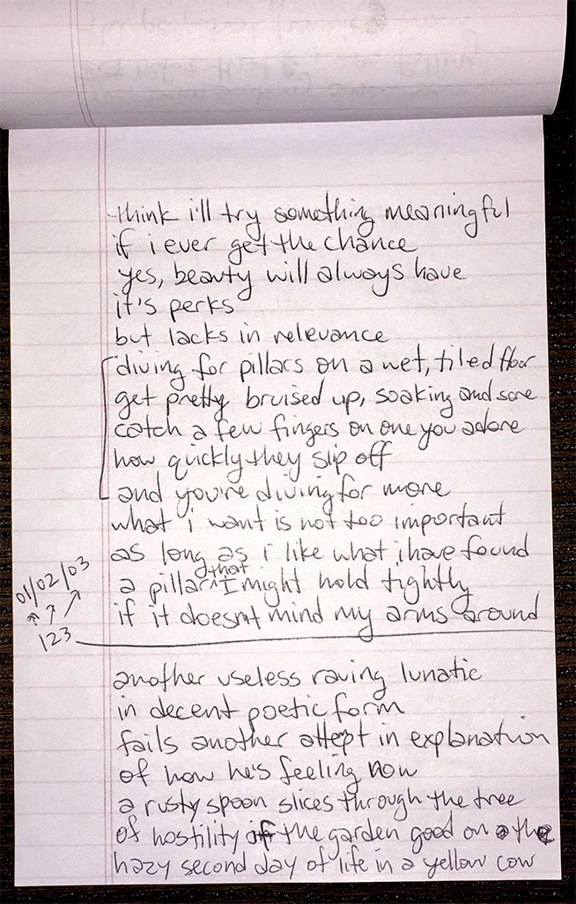

### pillars

think i'll try something meaningful \
if i ever get the chance \
yes, beauty will always have \
its perks \
but lacks in relevance

diving for pillars on a wet, tiled floor \
get pretty bruised up, soaking and sore \
catch a few fingers on one you adore \
how quickly they slip off \
and you're diving for more

what i want is not too important \
as long as i like what i have found \
a pillar that i might hold tightly \
if it doesn't mind my arms around

---

another useless raving lunatic \
in decent poetic form \
fails another attempt in explanation \
of how he's feeling now

a rusty spoon slices through the tree \
of hostility of the garden good on the \
hazy second day of life in a yellow cow

`2003.01.02`

