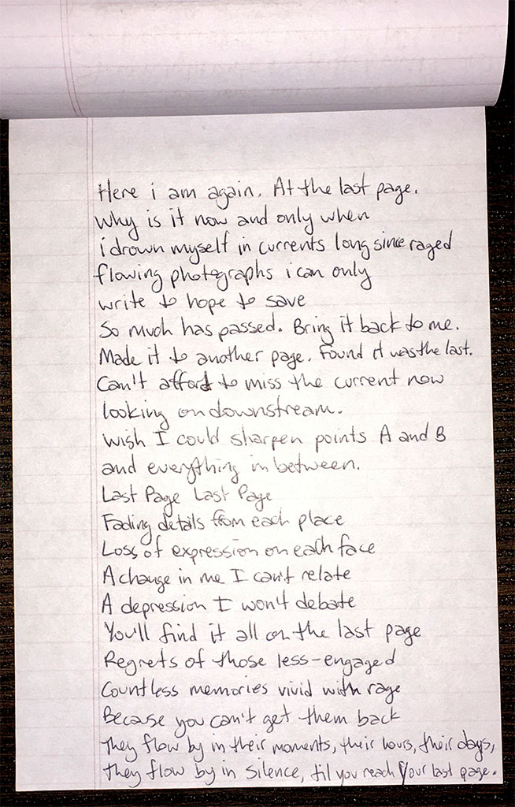

### last page

Here i am again. At the last page. \
Why is it now and only when \
i drown myself in currents long since raged

flowing photographs i can only \
write to hope to save \
so much has passed. Bring it back to me. \
Made it to another page. Found it was the last.

Can't afford to miss the current now \
looking on downstream. \
Wish I could sharpen points A and B \
and everything in between.

Last Page Last Page \
Fading details from each place \
Loss of expression on each face \
A change in me I can't relate \
A depression I won't debate \
You'll find it all on the last page \
Regrets of those less-engaged \
Countless memories vivid with rage

Because you can't get them back \
They flow by in their moments, their hours, their days \
They flow by in silence, til you reach your last page.

`2003.01`

