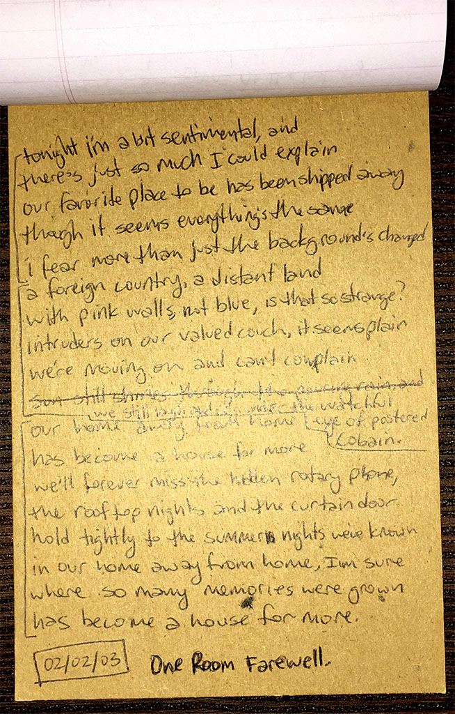

### one room farewell

tonight i'm a bit sentimental, and \
there's just so much I could explain \
our favorite place to be has been shipped away \
though it seems everything's the same \
i fear more than just the background's changed

a foreign country, a distant land \
with pink walls, not blue, is that so strange? \
intruders on our valued couch, it seems plain \
we're moving on and can't complain \
we still laugh and cry under \
the watchful eye of postered Cobain.

our home away from home \
has become a house for more \
we'll forever miss the hidden rotary phone, \
the rooftop nights and the curtain door \
hold tightly to the summer nights we've known \
in our home away from home, I'm sure \
where so many memories were grown \
has become a house for more.

`2003.02.02`

